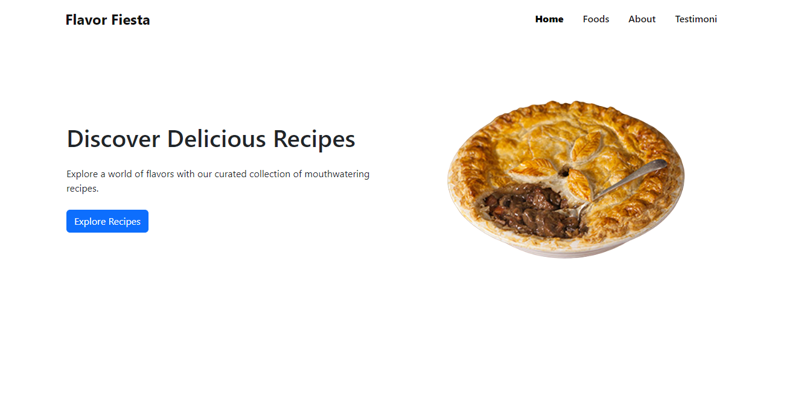
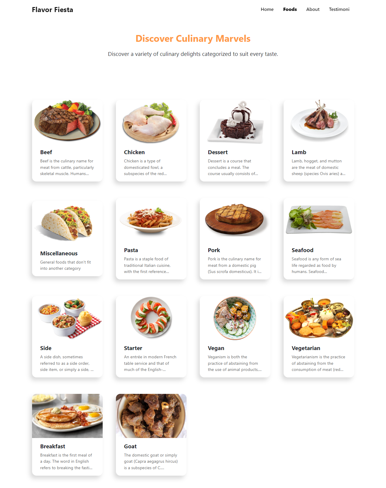
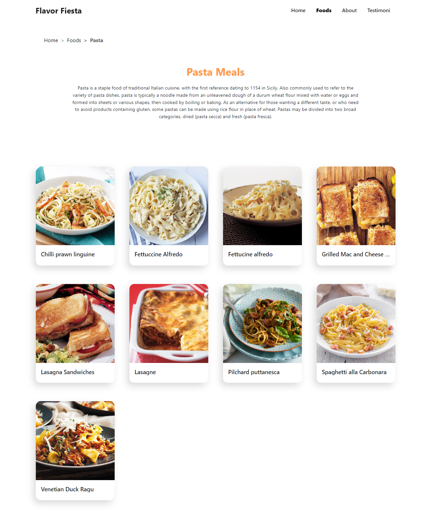
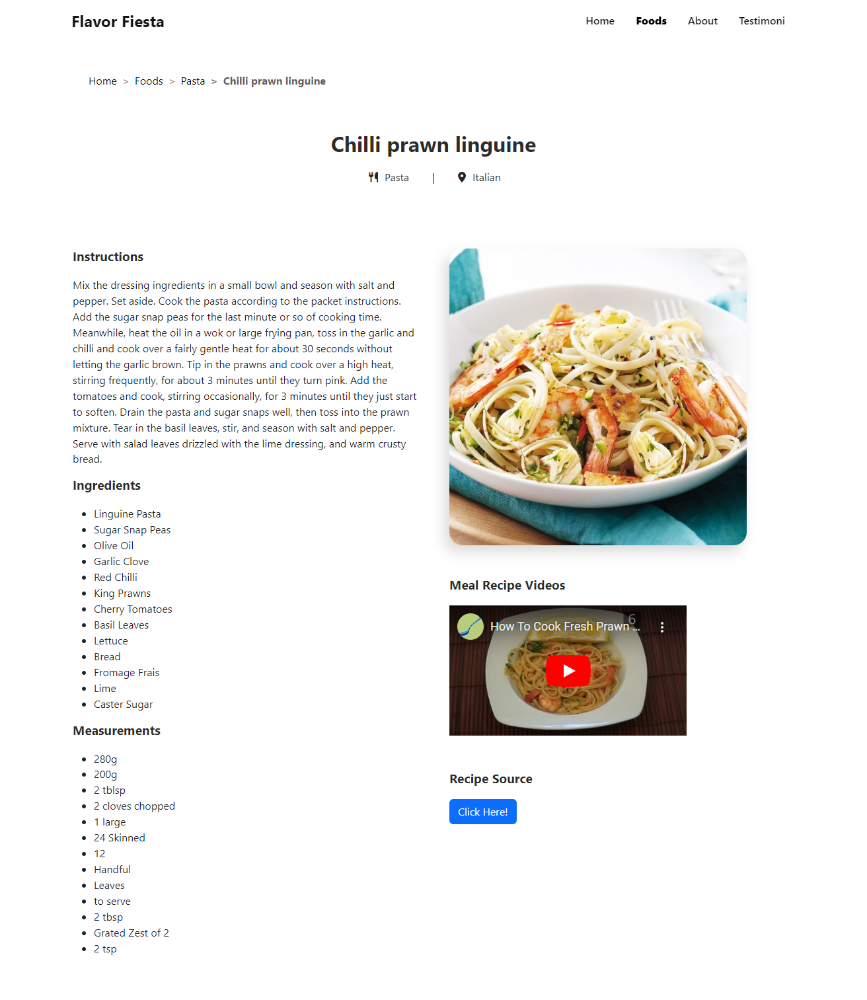

<p align="center">
    <a href="" rel="noopener">
        </a>
</p>

<h1 align="center" style="font-size:2rem;">Flavor Fiesta</h1>

<p align="center" style="font-size:1.2rem;">A website to make it easier for users to search for recipes by category</p>
    <br> 
</p>

## 📝 Table of Contents
- [About The Project](#about)
- [App Features](#fitur)
- [How to Execute](#usage)
- [App Usage Guidelines](#guideline)


## 🧐 About The Project<a name = "about"></a>
A web that serves to facilitate users in finding recipes based on categories. There are various processed recipes for Beef, Chicken, Goat Meat, Dessert, and others. In each recipe there is information about the ingredients needed, how to cook, and pictures of the recipe. In addition, users can also see cooking tutorials from the recipe through videos and recipe sources that have been provided.

## 🛠 **App Features** <a name = "fitur"></a>
* Main Page / Landing Page
* Category Page
* Category Detail Page / food by category
* Meals Recipe Page

## 🎈 **How to Execute** <a name="usage"></a>

**1. Clone the repository**

* ```git clone https://github.com/bintangsholu21/cmlabs-frontend-internship-test.git```


**2. Switch to the repo folder or go inside the cloned folder**

* ```cd cmlabs-frontend-internship-test```


**3. Open File ```index.html``` in your browser**

**OR**

**3. Open Folder in VSCode**

* ```code .```


**4. Open file ```index.html``` in VSCode**


**5. Run Live Server or if there is no install in the extension ``Live Server`` then right-click ``Open with Live Server``**


<br>

## 📸 **App Usage Guidelines** <a name = "guideline"></a>

#### 1. Main Page / Landing Page

</img>

#### 2. Category Page

</img>

Category Page is a page that displays a list of categories of recipes that can be selected by users. The categories that are displayed are Beef, Chicken, Dessert, Goat Meat, Lamb, Pasta, Pork, Seafood, Side, Starter, and Vegan. Users can select one of the categories to see the recipes in the category.


#### 3. Category Detail Page / food by category

</img>

Category Detail Page is a page that displays a list of recipes in a category that has been selected by the user. The recipes that are displayed are recipes that are in the category that the user selected. Users can select one of the recipes to see the recipe details.

#### 4. Meals Recipe Page

</img>

Meals Recipe Page is a page that displays the details of a recipe that has been selected by the user. The details that are displayed are the name of the recipe, the category of the recipe, the area of the recipe, the ingredients needed, the instructions for making the recipe, the source of the recipe, and the video tutorial for making the recipe. Users can see the video tutorial by clicking the play button on the video. Users can also see the source of the recipe by clicking the link in the source section.